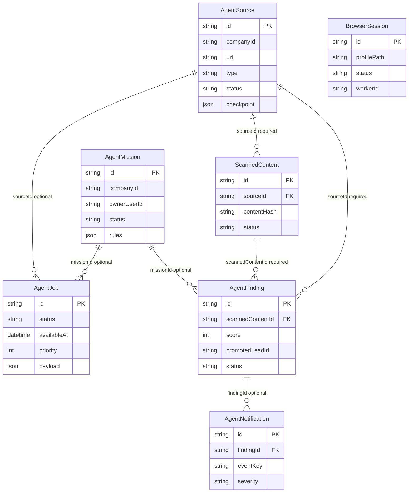

# AI Employee Platform — Data Model (Sprint 1.1)

> Branch: `feature/ai-employee-platform`  
> Migration: `add_ai_agent_platform`  
> Phạm vi: schema + migration only — không API, worker, UI.

---

## 1. Mục tiêu từng model

| Model | Mục tiêu |
|-------|----------|
| **AgentSource** | Nguồn quét (Facebook group, website, forum, search). Lưu URL, cấu hình, checkpoint chống trùng, lịch quét. |
| **AgentMission** | Mục tiêu nghiệp vụ (rules, schedule). Gom jobs và findings theo chiến dịch. |
| **AgentJob** | Hàng đợi job PostgreSQL-native (`queued` → `claimed` → `running` → …). Worker claim sau này. |
| **BrowserSession** | Metadata phiên browser ngoài process web (profile path, heartbeat). **Không** lưu cookie/token. |
| **ScannedContent** | Bài viết/nội dung thô thu thập từ nguồn. Bước trung gian trước Lead. |
| **AgentFinding** | Kết quả AI phân tích trên `ScannedContent`. Chỉ finding đủ điểm mới promote Lead (phase sau). |
| **AgentNotification** | Thông báo cho user/admin (finding mới, lỗi scan, v.v.). |

---

## 2. Quan hệ giữa các model

```
AgentSource ──┬──< AgentJob (optional sourceId)
              ├──< ScannedContent (required)
              └──< AgentFinding (required)

AgentMission ──┬──< AgentJob (optional missionId)
               └──< AgentFinding (optional missionId)

ScannedContent ──< AgentFinding (required, unique per type)

AgentFinding ──< AgentNotification (optional)

Lead ←── promotedLeadId (String index only, NO Prisma FK)
```

**Không** liên kết Prisma tới `Company`, `User`, `CmsRecord`, hoặc `Lead` — chỉ `companyId` / `ownerUserId` / `promotedLeadId` dạng `String?` có index.

---

## 3. ERD (Mermaid)



---

## 4. Danh sách trạng thái

### AgentSource.status
`active` | `paused` | `error`

### AgentMission.status
`draft` | `active` | `paused` | `completed`

### AgentJob.status
`queued` | `claimed` | `running` | `completed` | `failed` | `cancelled`

### BrowserSession.status
`offline` | `starting` | `ready` | `running` | `needs_login` | `error`

### ScannedContent.status
`collected` | `analyzed` | `ignored` | `finding_created`

### AgentFinding.status
`new` | `reviewed` | `promoted` | `dismissed`

### AgentNotification.status
`unread` | `read` | `archived`

### AgentNotification.severity
`info` | `success` | `warning` | `error` | `critical`

### AgentSource.type (dự kiến)
`facebook_group` | `website` | `forum` | `search`

---

## 5. Chiến lược multi-tenant

- Mọi bảng agent có `companyId String?` + index.
- `companyId = null` = nguồn/mission toàn hệ thống (owner) — dùng có kiểm soát ở API phase sau.
- **Không** FK tới `companies` vì model `Company` chỉ bọc JSON blob CMS, không phải tenant boundary relational ổn định.
- Query pattern phase sau: `WHERE company_id = $tenant OR (company_id IS NULL AND $isOwner)`.
- `ownerUserId` / `userId` trên mission/notification: string tham chiếu user CMS, không FK `users`.

---

## 6. Chiến lược chống trùng

| Lớp | Cơ chế |
|-----|--------|
| **Nội dung** | `@@unique([sourceId, contentHash])` — hash nội dung chuẩn hóa, không dùng `canonicalUrl` unique |
| **Nguồn** | `@@unique([companyId, url])` — xem mục 6.1 |
| **Finding** | `@@unique([scannedContentId, type])` — một loại finding per bài |
| **Notification** | `@@unique([companyId, eventKey])` khi `eventKey` được set — xem mục 6.2 |
| **Checkpoint** | `AgentSource.checkpoint` JSON — cursor/page/timestamp do worker cập nhật (phase sau) |
| **externalId** | Index `[sourceId, externalId]` — dedup phụ khi platform cung cấp ID ổn định |

### 6.1 `companyId` nullable + unique URL

PostgreSQL coi `NULL` khác `NULL` trong unique constraint:

- `(companyId='comp-a', url)` — unique trong tenant ✓
- `(companyId=NULL, url)` — **có thể trùng URL** nhiều dòng

**Giải pháp MVP:** API phase sau bắt buộc `companyId` cho tenant sources; global sources (`null`) giới hạn bởi owner role. Có thể bổ sung partial unique index trong migration tương lai:

```sql
CREATE UNIQUE INDEX agent_sources_global_url_unique
  ON agent_sources (url) WHERE company_id IS NULL;
```

### 6.2 `eventKey` nullable + dedup notification

- `@@unique([companyId, eventKey])`: khi `eventKey IS NULL`, PostgreSQL cho phép nhiều bản ghi (không dedup).
- Khi cần dedup: set `eventKey` cố định (vd. `finding:{id}:created`) + `companyId`.
- Nhiều `(companyId, NULL)` được phép — phù hợp notification ad-hoc.

---

## 7. Giữ lịch sử khi xóa source/mission

| Relation | onDelete | Lý do |
|----------|----------|-------|
| `AgentJob.mission` | **SetNull** | Xóa mission không xóa job lịch sử; `missionId` null, job vẫn audit được |
| `AgentJob.source` | **Restrict** | Không xóa source khi còn job (phải archive/cancel job trước) |
| `ScannedContent.source` | **Restrict** | Không xóa source khi còn content — bảo toàn lịch sử điều tra |
| `AgentFinding.mission` | **SetNull** | Mission xóa không mất finding |
| `AgentFinding.source` | **Restrict** | Finding gắn chặt provenance nguồn |
| `AgentFinding.scannedContent` | **Restrict** | Không xóa content khi còn finding |
| `AgentNotification.finding` | **SetNull** | Notification giữ lại khi finding bị gỡ (audit) |

**Không** dùng `Cascade` hàng loạt trên content/finding/job.

`BrowserSession` độc lập — xóa session không ảnh hưởng pipeline nội dung.

---

## 8. Index quan trọng

| Index | Phục vụ |
|-------|---------|
| `agent_jobs (status, available_at, priority)` | Job queue polling |
| `agent_sources (status, next_scan_at)` | Scheduler quét nguồn (phase sau) |
| `scanned_contents (source_id, content_hash)` UNIQUE | Chống trùng nội dung |
| `agent_findings (status, score)` | Queue review / promote |
| `browser_sessions (last_heartbeat_at)` | Phát hiện worker chết |
| `agent_notifications (user_id, status, created_at)` | Inbox admin |

---

## 9. Lý do không dùng `cms_records`

1. Agent pipeline có vòng đời riêng (scan → analyze → finding → lead) — không phù hợp JSON blob + in-memory cache.
2. Job queue cần index transactional (`status`, `availableAt`) — `cms_records` không tối ưu cho polling.
3. Ràng buộc sprint: **không** đưa agent vào `dbHelper.ts` cache.
4. Tách biệt giảm rủi ro `writeDatabase()` flush toàn bộ CMS khi worker ghi job.

---

## 10. Migrate local

```bash
# PostgreSQL phải chạy (port 5434 cluster hoặc 5432 service)
npm run db:pg-start
npm run db:setup-local   # lần đầu

npx prisma format
npx prisma validate
npx prisma generate
npm run lint
npm run build
```

### 10.1 Áp dụng migration `add_ai_agent_platform`

DB hiện tại được tạo bằng `prisma db push` (chưa có lịch sử migrate). Trên dev cluster PostgreSQL có thể **không** có quyền tạo shadow database → `migrate dev` fail `P3014`.

**Cách đã xác minh (local):**

```bash
# SQL sinh bởi Prisma (không đoán mò):
npx prisma migrate diff \
  --from-schema-datasource prisma/schema.prisma \
  --to-schema-datamodel prisma/schema.prisma \
  --script -o prisma/migrations/20260710103000_add_ai_agent_platform/migration.sql

# Áp dụng + đánh dấu đã migrate (baseline lần đầu):
npx prisma db execute --file prisma/migrations/20260710103000_add_ai_agent_platform/migration.sql
npx prisma migrate resolve --applied 20260710103000_add_ai_agent_platform
npx prisma migrate status   # → Database schema is up to date!
```

Nếu `migrate dev` chạy được (user có quyền shadow DB):

```bash
npx prisma migrate dev --name add_ai_agent_platform
```

---

## 11. Migrate production

**Không** dùng `prisma db push --accept-data-loss` (hiện có trong `deploy.ps1` — rủi ro cao).

Production cũng đang dùng `db push` — lần đầu chuyển sang migrate cần **baseline** (tương tự local):

```bash
# 1. Backup (bắt buộc)
npm run backup:prod

# 2. Trên VPS
cd /var/www/real-estate-ai-cms
set -a && . ./.env && set +a

# 3a. Nếu _prisma_migrations trống / chưa từng migrate:
npx prisma db execute --file prisma/migrations/20260710103000_add_ai_agent_platform/migration.sql
npx prisma migrate resolve --applied 20260710103000_add_ai_agent_platform

# 3b. Sau khi đã baseline, các sprint sau chỉ cần:
npx prisma migrate deploy

npx prisma generate
npm run build
pm2 restart real-estate-ai-cms --update-env
```

Khuyến nghị sprint sau: đổi `deploy.ps1` từ `db push` sang `migrate deploy`.

---

## 12. Rollback

1. **Trước migrate:** `npm run backup:prod` → file `backups/db-YYYYMMDD.sql` trên VPS.
2. **Rollback code:** deploy commit trước migration (schema cũ không biết bảng agent — OK nếu chưa dùng agent).
3. **Rollback DB** (nếu migration đã apply và cần revert):
   ```bash
   psql "$DATABASE_URL" < backups/db-YYYYMMDD.sql
   pm2 restart real-estate-ai-cms
   ```
4. **Không** sửa/xóa migration đã apply trên production — tạo migration mới để revert schema nếu cần.

---

## 13. ID generation

Model agent mới dùng `@default(cuid())` — khác convention CMS (`p-${Date.now()}` trong app). Phù hợp bảng Prisma-native, worker ghi trực tiếp.

---

## 14. Feature flags (`.env.example`)

```env
AGENT_ENABLED=false
AGENT_SCHEDULER_ENABLED=false
```

Chưa wire vào code trong Sprint 1.1.

---

## 15. `promotedLeadId` — không FK Lead

Model `Lead` không được sửa trong sprint. `promotedLeadId` là tham chiếu mềm:

- Index tra cứu ngược
- Phase promote: ghi ID lead sau `INSERT` vào `leads`
- Xóa lead trên CMS không tự cập nhật finding — job reconcile phase sau

---

*Tài liệu đi kèm migration `add_ai_agent_platform`.*
