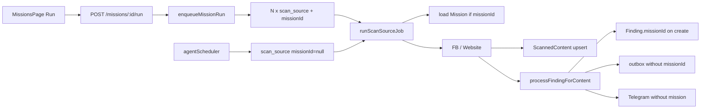

# Mission 2.0 — Current-State Audit

**Branch:** `feature/mission-workflow-engine`  
**Date:** 2026-07-15  
**Base:** post AI Scanner 2.0 / Spam Control + frontend architecture  

**Verdict:** Mission hôm nay là lớp mỏng bọc Source scan — Run tạo N job `scan_source`, worker load Mission cho rules, Finding có `missionId` optional. **Chưa có** MissionRun / StepRun / M2M Source. Mission 2.0 cần migration thật.

---

## 1. Mission hiện lưu những field nào?

`prisma/schema.prisma` → `AgentMission` (`agent_missions`):

| Field | Type | Notes |
|-------|------|--------|
| `id` | String cuid | |
| `companyId` | String? | tenant |
| `ownerUserId` | String? | |
| `name` | String | |
| `objective` | String Text | |
| `status` | String default `draft` | draft / active / paused / completed |
| `rules` | Json `{}` | sourceIds, keywords, scores, domain, analysisMode… |
| `schedule` | Json? | UX only — scheduler **không đọc** |
| `createdAt` / `updatedAt` | DateTime | |

Relations: `jobs`, `findings`. **Không** relation tới `AgentSource`.

---

## 2. Mission hiện chạy bằng endpoint nào?

| Endpoint | File | Action |
|----------|------|--------|
| **`POST /api/agent/missions/:id/run`** | `server/agent/agentRoutes.ts` | `enqueueMissionRun` |
| `POST /api/agent/sources/:id/run` | same | `enqueueSourceScan` (+ optional `missionId`) |

CRUD/templates: `GET/POST/PATCH /api/agent/missions`, `GET .../templates`, `POST .../from-template`.

UI: `src/features/agent/missions/pages/MissionsPage.tsx` → `runAgentMission`.

---

## 3. Run Mission hiện tạo job gì?

**`scan_source`** — không có job type `scan_mission`.

`enqueueMissionRun` (`server/agent/agentJobService.ts`): 1 job / nguồn đã resolve, `missionId` set, payload `{ missionId, sourceId, triggeredBy, enqueuedAt }`.

---

## 4. Job có missionId không?

**Có.** `AgentJob.missionId` (schema + index).  
Scheduler tick **không** set `missionId`.

---

## 5. Worker có thật sự load Mission không?

**Có**, khi `job.missionId` hoặc `payload.missionId` có mặt.

`runScanSourceJob` (`server/agent-worker/scanSourceHandler.ts`) → `prisma.agentMission.findUnique` → pass vào adapter `scan({ mission })` → `processFindingForContent`.

Job từ scheduler-only: `mission === null` → chỉ config Source / defaults.

---

## 6. Mission rules hiện ảnh hưởng bước nào?

Via `resolveLeadAnalysisConfig` (`server/agent/analysisConfig.ts`) + `findingRuleEngine`:

| Concern | Affected? |
|---------|-----------|
| Scan caps (`maxItemsPerRun`) | Yes |
| Positive/negative keywords | Yes |
| Default RE keyword pack | Yes (if empty) |
| `analysisMode` / thresholds / prefilter | Yes |
| `targetClassifications` / domain gate | Yes |
| Finding create + `notifyScore` | Yes |
| `analysisInstructions` | **No** (stored, unused in AI) |
| Mission `schedule` | **No** (scheduler source-driven) |

Spam Control: global/company/source; `AgentSpamRule.missionId` exists but pipeline evaluate không bắt buộc mission scope MVP.

---

## 7. Mission sourceIds — JSON hay relation?

**JSON trong `AgentMission.rules.sourceIds`.**  
Không bảng join.  
`resolveMissionSourceIds`: nếu rỗng → **tất cả Source active của company** (nguy hiểm).

---

## 8. Finding có missionId / provenance đầy đủ chưa?

**Partial.**

- Có cột `AgentFinding.missionId` — set **chỉ lúc create**.
- Unique `[scannedContentId, type]` → không Finding riêng per Mission.
- Facebook known content → bỏ qua re-analysis.
- Sync outbox / Telegram: **không** mang missionId/name.
- Không MissionRun / StepRun IDs.

---

## 9. Scheduler đang enqueue Source hay Mission?

**Source only.**  
`agentScheduler.ts`: `scan_source`, không MissionRun, không đọc Mission.schedule.

---

## 10. Duplicate scan khi nhiều Mission cùng Source?

**Có (mission Run path).**  
Scheduler dedupe job active per `sourceId`.  
`enqueueMissionRun` **không** guard → Mission A+B cùng Source → nhiều job scan song song / nối đuôi.

---

## 11. Tái sử dụng ScannedContent cho nhiều Mission?

**Có** — unique theo `sourceId + contentHash`, không theo Mission.  
Reuse content OK; re-analysis multi-mission **yếu** (FB skip; Finding không nhân bản).

---

## 12. Code giữ lại

- Source adapters (FB/website), browser lifecycle  
- `scan_source` worker path  
- ScannedContent + hash/dedupe  
- Spam / extract / classify / findingRuleEngine / lead intelligence  
- Matching, External Inventory, Telegram, notifications  
- Outbox + ingest (cần mở rộng provenance)  
- Mission CRUD + templates shell + Jobs UI  
- Source Run legacy path  

---

## 13. Phần cần thay thế / mở rộng

| Hiện tại | Mission 2.0 |
|----------|-------------|
| Flat Mission + JSON sourceIds | MissionSource M2M + pipeline |
| Run = fan-out scan_source | MissionRun + StepRun orchestration |
| Rules blob | Versioned pipeline JSON + validation |
| Soft finding provenance | missionRunId / stepIds trên outputs |
| Unused schedule | Schedule MissionRun OR keep source scheduler clearly |
| No step idempotency | Step uniqueness keys |
| Ingest always Finding path (legacy) | Chỉ Finding nếu pipeline có step |

---

## 14. Có cần migration không?

**Có — bắt buộc.**

Tạo:

- `AgentMissionRun`
- `AgentWorkflowStepRun`
- `AgentMissionSource` (M2M)
- Backfill `sourceIds` → MissionSource
- Optional: pipeline snapshot trên Mission (`rules.pipeline` hoặc cột `pipeline`)

Giữ field Mission cũ; không hard-delete.

---

## Architecture snapshot (current)

---

## Implication cho Mission 2.0

1. **Không** phá `scan_source` / Scanner 2.0 / Spam — wrap bằng workflow after collect.  
2. Default / legacy Source Run: pipeline tương đương “spam → extract → classify → finding → notify”.  
3. Serialize collection per Source khi nhiều Mission; phân tích riêng StepRun per Mission.  
4. Ingest: payload có Mission → không auto-Finding ngoài workflow; legacy payload giữ behavior cũ.  
5. Local collect / VPS canonical analysis — bước `executionTarget` trên step definition.

---

## Audit complete — proceed Phase 1–2 implementation

Next: workflow types + validation + MissionRun/StepRun/MissionSource migration + backfill.
